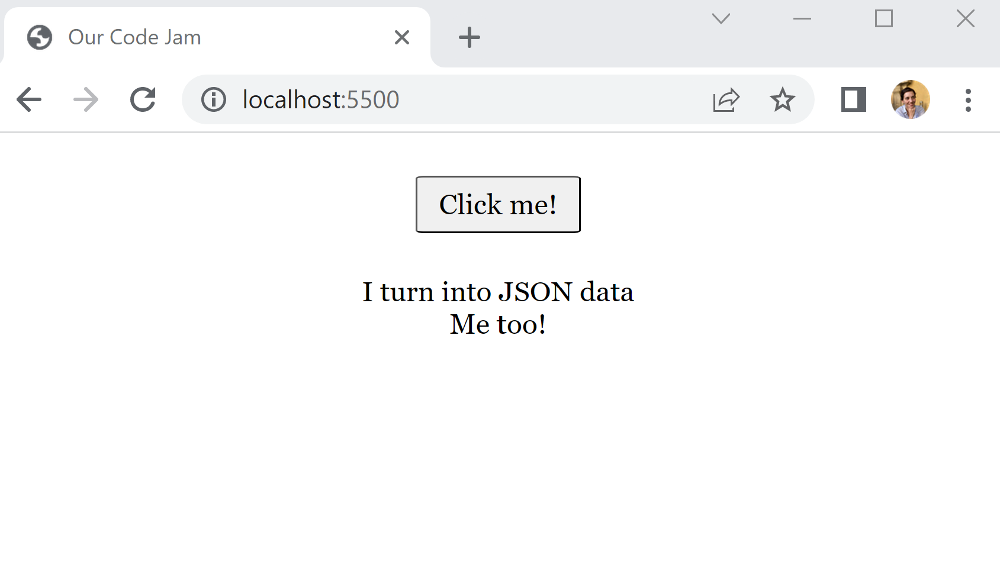
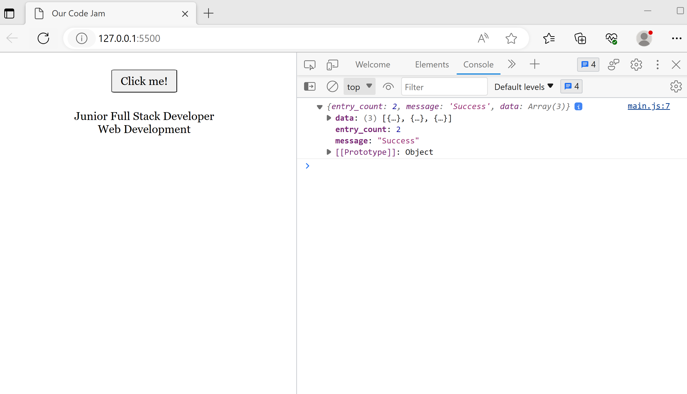
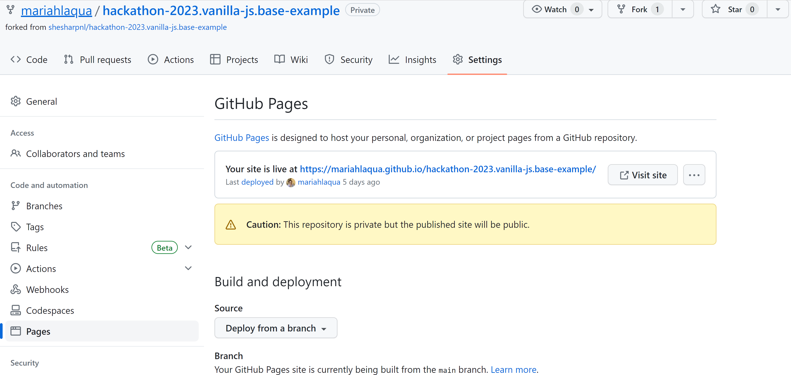
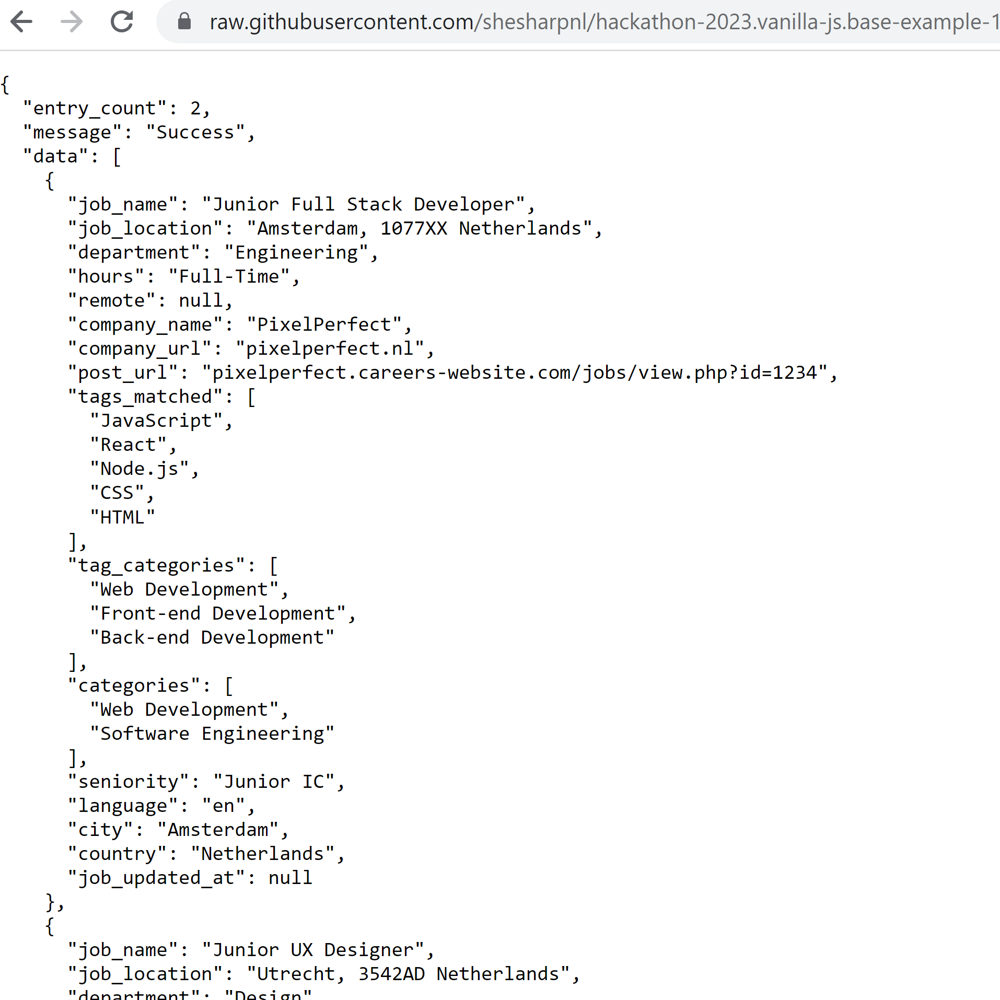
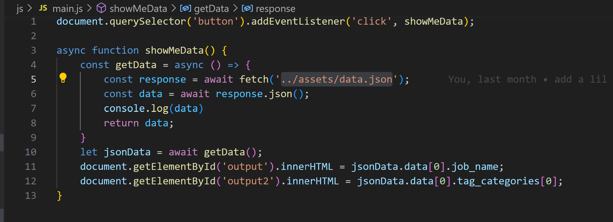

# An HTML, CSS and JS frontend website boilerplate

# hackathon-2023.vanilla-js.base-example

This a starter template that uses HTML, CSS and JavaScript to manipulate and render data from a JSON file of data.

Assets holds the data.json file. This is also a place where we can add images or other static assets.

"css" holds stylesheets. The normalize stylesheet aims to make styling consistent across browsers, and the main.css file is where we can write custom styles for our webpage. You are welcome to add more css files or any other css tools of your preference. The provided stylesheets are already imported into the index.html file. 

"js" contains a main.js file. This script is imported into the index.html file. A basic script is implemented that tells the browser to fetch and render JSON data when the user clicks the button.

The index.html file is the starting point. More pages can always be added.

## Table of Contents

- [Prerequisites](#prerequisites)
- [Installation](#installation)
    - [1) Fork the repository](#forking-the-repository)
    - [2) Clone the repository](#cloning-the-repository)
    - [3) Install dependencies](#installing-dependencies)
- [Usage](#usage)
    * [Inspect the console and see the project in your browser](#inspect-the-console-and-see-the-project-in-your-browser)
    * [Changing the styling with css](#changing-the-styling-with-css)
- [Contributing](#contributing)
- [License](#license)

## Prerequisites

## Hold up! Want to just code in your browser?

You can access the project on Codepen.io as a template. You will need a Codepen account! Once you've signed into your account, [click this link](https://codepen.io/mariahlaqua/pen/MWzYObG), and from the bottom right corner choose fork! Otherwise, continue reading...

Before you can install, use this project and add extra functionalities to it, you need to have the following prerequisites and software installed on your computer:

- **A personal GitHub account**. If you don't already have one, you can sign up for free [here](https://github.com/).
- **Git**: this is a version control system that allows you to manage and track changes to your code. You can download and install Git from the official website [here](https://git-scm.com/downloads).
- **A terminal**: this is the application that allows you to enter commands into your computer. You can use the default terminal on your operating system, or install a third-party terminal such as [iTerm2](https://iterm2.com/) for macOS or [Windows Terminal](https://aka.ms/terminal) for Windows.
- **A code editor**: this is the application that allows you to write and edit code. One popular code editor choice is [Visual Studio Code](https://code.visualstudio.com/).
- **JavaScript**: this is the programming language used in this project. You don't need to install it separately, as it comes pre-installed with most web browsers.
- **Google Chrome**: Google Chrome is a web browser with useful developer tools that allow you to inspect page elements and view the browsers console. [Google Chrome Web Browser](https://www.google.com/chrome/)

Once you have all of these prerequisites, you're ready to move on to the installation steps.

## Installation

To install and being able to use this frontend project, you need to fork this repository to your own GitHub account and then clone your forked repository to your local machine.

- [1) Fork the repository](#forking-the-repository)
- [2) Clone the repository](#cloning-the-repository)
- [3) Install dependencies](#installing-dependencies)

### 1) Fork the repository

1. Go to the repository page on GitHub: [https://github.com/shesharpnl/hackathon-2023.vanilla-js.base-example](https://github.com/shesharpnl/hackathon-2023.vanilla-js.base-example).  

2. Click the "Fork" button in the top right corner of the repository page. This will create a copy of the repository in your own GitHub account.

### 2) Clone the repository

1. Once you have forked the repository, navigate to the forked repository on your GitHub account: [https://github.com/YOUR_USERNAME/hackathon-2023.vanilla-js.base-example](https://github.com/YOUR_USERNAME/hackathon-2023.vanilla-js.base-example). Replace `YOUR_USERNAME` with your GitHub username.

2. Click the "Code" button and copy the HTTPS or SSH link to the repository.

3. Open your terminal and navigate to the directory where you want to store the project. For example: `cd ~/projects`.

4. Type `git clone` followed by the repository link you copied earlier, then press Enter (remember to replace `YOUR_USERNAME` with your GitHub username):

```
git clone https://github.com/YOUR_USERNAME/hackathon-2023.vanilla-js.base-example.git
```

5. Press Enter again to execute the command. This will download the repository to your local machine. If you are cloning the repository using HTTPS, you may be prompted to enter your GitHub username and password. 
If you are cloning the repository using SSH, you will need to set up authentication via SSH. You can find instructions for doing so [here](https://docs.github.com/en/authentication/connecting-to-github-with-ssh). Once you have set up authentication via SSH, you can clone the repository using the SSH URL.

### 3) Install dependencies

For this project, we recommend a live server extenstion for your code editor.
[VS Code Live Server](https://marketplace.visualstudio.com/items?itemName=ritwickdey.LiveServer)

### Enable GitHub Pages

To enable GitHub Pages and be able to see your project deployed, you can follow these steps:

1. Go in your forked repository, in the settings tab
2. On the settings sidebar, click on the Pages link
3. In the Build and deployment section, select:
   1. the Source option "Deploy from a branch"
   2. the Branch option "Main" & "/root"
4. Click on "Save" in the Build and deployment section


You can now access the website at this URL:

https://YOUR_USERNAME.github.io/hackathon-2023.vanilla-js.base-example/


## Usage

This is how the boilerplate will look rendered in the browser:



This boilerplate can be used to build a website, experiment with styling, or to build confidence with JavaScript and DOM manipulation.
### Inspect the console and see the project in your browser

To verify that the project works, you can follow these steps:  

1. Open the root folder of your project in your code editor.
2. Open the index.html file.
3. Run your index.html file with your live server extension.
4. If the browser does not automatically open, open Google Chrome and navigate to the localhost port specified by your Live Server extension.
5. Open Chrome developer tools by hitting the F12 key or right clicking in the browser window and selecting 'inspect.'
6. Select the console tab within the developer tools.
7. Click the button that says "Click me!".
8. The text rendered on the page should change, and the same text should show up as a message in your console - see the next point, Using the Console to Debug for more details on the browser console.

If you encounter any issues, you can try the following steps to troubleshoot:  

1. Check that you are accessing the site on the correct port in your browser.
2. Make sure that you opened the index.html file from the root directory.
3. Still having issues? You can also upload the project to an online service such as [Codepen](https://codepen.io/).

### Using the console to debug

In the 'main.js' file on line 7 the log() method is called on the console. The console is a part of the browser. In this case, we ask that the console logs the 'data' from the JSON. This is a useful tool to test the results of our JavaScript code. You can access the console by right-clicking your browser window and choosing inspect then, console from the top right area:



By console logging we can see some output of our code, as well as any error messages the browser sends us when it attempts to execute the code.

### Changing the styling with css

Our custom styles can be declared in the 'main.css' file within the css folder. Some simple classes are defined that allow our button to have a bit of flare and the entire body to have some style. You can experiment with styling whole elements (such as the body selector) or create custom classes (such as the .btn class).

### Deploying with GitHub pages

If you'd like to see your webpage live, you can easily deploy with GitHub pages. Simply go to your forked repository on your github account and choose settings. On the left sidebar navigation then choose "Pages." Choose the branch to deploy from - usually main - and select save. This process can take a minute or two, so feel free to take a stretch break and refresh the page when you're back.



Nice. There's just one more small change we need to make in our script.js file to get everything up and running on our live github site.

Head to your repository in the browser. Open the assets folder, choose the json file and click on "raw" from the toolbar at the top of the file preview. You should see something like this:



In the address bar of your browser copy the whole raw.githubuser url. Replace the fetch url with the url you copied. The fetch url is the highlighted text in this image:



## Contributing

Contributions to this project are welcome! If you find a bug, have a feature request, or want to contribute code, please follow these guidelines:

1. Fork the repository and clone it to your local machine.
2. Create a new branch for your changes: `git checkout -b my-branch-name`
3. Make your changes, and test them thoroughly.
4. Commit your changes with a descriptive commit message.
5. Push your changes to your forked repository: `git push origin my-branch-name`
6. Open a pull request against the main branch of this repository, explaining the changes you've made and why they are important.

Thank you for your contributions!

## Credits

The job data has been retrieved using [SourceStack](https://sourcestack.co).

## License

This project is licensed under the MIT License - see the [LICENSE](LICENSE) file for details.
